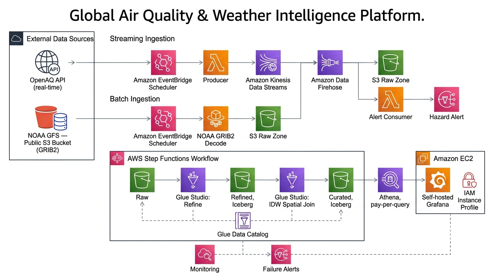

# Global Air Quality & Weather Intelligence Platform

A serverless, end-to-end data pipeline on AWS that ingests, transforms, and visualizes global air quality and weather forecast data from [OpenAQ](https://openaq.org/) and [NOAA GFS](https://nomads.ncep.noaa.gov/).



## Architecture

```
OpenAQ API ──► Kinesis Firehose ──► S3 (raw/openaq) ──┐
                                                        ├──► Glue ETL ──► S3 (refined) ──► Glue Join ──► S3 (curated/fact)
NOAA GFS  ──► Kinesis Firehose ──► S3 (raw/noaa_gfs) ──┘                                                         │
                                                                                                                   ├──► Athena ──► Grafana
                                                                                                                   │
                                                                                                          Glue Dimensions ──┘
```

### AWS Services Used
| Service | Purpose |
|---------|---------|
| **S3** | Data lakehouse (raw → refined → curated) |
| **Kinesis Data Firehose** | Real-time ingestion from OpenAQ & NOAA |
| **AWS Glue** | ETL jobs, Data Catalog, Iceberg tables |
| **Amazon Athena** | SQL queries on curated data |
| **AWS Lambda** | Alert consumer (anomaly detection) |
| **Amazon SNS** | Alert notifications |
| **AWS Step Functions** | Pipeline orchestration |
| **Amazon EventBridge** | Scheduled pipeline triggers |
| **Amazon CloudWatch** | Monitoring & log aggregation |
| **Amazon EC2** | Grafana dashboard server |
| **Grafana** | Data visualization dashboards |

## Data Sources

- **OpenAQ** — Global air quality measurements (PM2.5, PM10, NO₂, O₃, CO, SO₂, temperature, etc.) from 50+ monitoring stations worldwide
- **NOAA GFS** — Global weather forecast model data (temperature, wind, humidity, precipitation)

## Data Layers

| Layer | Format | Location | Description |
|-------|--------|----------|-------------|
| **Raw** | CSV/Parquet | `s3://.../raw/` | Unprocessed API responses |
| **Refined** | Parquet | `s3://.../refined/` | Cleaned & typed data |
| **Curated** | Parquet (Iceberg) | `s3://.../curated/` | Star schema (fact + dimensions) |

### Tables
- `fact_air_quality_weather` — Joined AQ measurements with weather forecasts (1,996 rows)
- `openaq_historical` — 3M rows of historical OpenAQ data (2006–2026)
- `dim_station` — Station metadata (lat/lon, name, country)
- `dim_date` — Date dimension (year, month, quarter, weekday)
- `dim_pollutant` — Pollutant reference (parameter, units)

## Project Structure

```
├── Terraform/                  # Infrastructure as Code
│   ├── main.tf                 # S3 bucket & folders
│   ├── Variables.tf            # Input variables
│   ├── Foundation.tf           # IAM, Glue DB, Athena
│   ├── kinesis.tf              # Kinesis Firehose streams
│   ├── glue_jobs.tf            # Glue ETL jobs
│   ├── iceberg_tables.tf       # Iceberg table definitions
│   ├── lambda.tf               # Lambda function (NOAA decoder)
│   ├── lambda_alert_consumer.tf # Alert consumer Lambda
│   ├── eventbridge.tf          # Scheduled triggers
│   ├── step_functions.tf       # Pipeline orchestration
│   ├── ec2_grafana.tf          # Grafana EC2 instance
│   ├── monitoring.tf           # CloudWatch alarms
│   ├── sns.tf                  # Alert notifications
│   └── s3_policy.tf            # S3 access policies
│
├── scripts/                    # ETL & utility scripts
│   ├── refined_openaq.py       # Glue ETL: raw → refined OpenAQ
│   ├── refined_noaa.py         # Glue ETL: raw → refined NOAA
│   ├── spatial_temporal_join.py # Glue ETL: spatial join (fact table)
│   ├── populate_dimensions.py  # Glue ETL: dimension tables
│   ├── data_quality.py         # Glue ETL: data quality checks
│   └── alert_consumer.py       # Lambda: anomaly detection
│
├── noaa_decode.py              # NOAA GFS GRIB decoder (Docker)
├── Dockerfile                  # Container for NOAA decoder
├── openaq_poller.py            # OpenAQ API poller
├── athena-datasource.yaml      # Grafana Athena datasource config
├── CHANGELOG_2026-08-07.md     # Development changelog
└── pipeline.png                # Architecture diagram
```

## Setup

### Prerequisites
- AWS CLI configured with Academy Learner Lab credentials
- Terraform ≥ 1.0
- Python 3.11+

### Deploy Infrastructure
```bash
cd Terraform
terraform init
terraform plan
terraform apply
```

### Run Pipeline
The pipeline runs automatically via EventBridge, or trigger manually:
```bash
aws stepfunctions start-execution \
  --state-machine-arn <STATE_MACHINE_ARN> \
  --input '{}'
```

### Grafana Dashboards
- **URL:** `http://<EC2_PUBLIC_IP>:3000`
- **Login:** `admin` / `admin`
- **Dashboards:**
  - [Historical Air Quality Data](http://<EC2_PUBLIC_IP>:3000/d/historical-aq/) — 3M rows, geomap, trends
  - [Live Air Quality Monitoring](http://<EC2_PUBLIC_IP>:3000/d/live-monitoring/) — fact table, region analysis

## Key Features

- **3 million historical data points** from OpenAQ (2006–2026)
- **Real-time ingestion** via Kinesis Firehose
- **Star schema** with Iceberg tables for ACID transactions
- **Automated pipeline** with Step Functions orchestration
- **Anomaly detection** via Lambda alert consumer
- **Geospatial visualization** with Grafana geomap panels
- **50 monitoring stations** across 7 regions worldwide

## License

MIT
